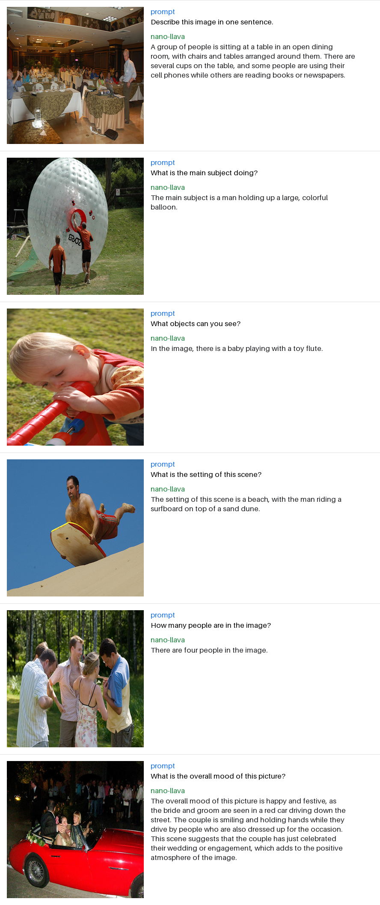

# nano-LLaVA: a minimal vision-language model

A small **vision-language model** that answers questions about images, trained
from scratch on a single GPU.

A minimal reproduction of LLaVA
([Liu et al., 2023](https://arxiv.org/abs/2304.08485)) and its LLaVA-1.5
follow-up ([Liu et al., 2023](https://arxiv.org/abs/2310.03744)). A **frozen
CLIP** vision encoder and a **frozen Qwen2.5-0.5B** language model are bridged
by a small **MLP projector**; only the projector and LoRA adapters are trained.
The faithful two-stage recipe - projector pretraining then visual instruction
tuning - runs end to end in under an hour on one A100.



*Held-out Flickr30k images with nano-LLaVA's answers, stage 1 + 2.*

## Quickstart

```bash
git clone https://github.com/YannickGibson/nano-llava.git && cd nano-llava
uv sync                                         # creates .venv and installs everything

uv run python train.py --stage 1                # projector pretraining, ~10 min on one A100
uv run python train.py --stage 2                # visual instruction tuning, ~35 min
uv run python train.py --stage 2 --wandb        # with live W&B tracking
uv run python chat.py --image photo.jpg --prompt "What is happening here?"
uv run python eval.py                           # VQAv2 accuracy
uv run python ablation.py                       # stage-2 on/off comparison
uv run python grid.py                           # qualitative example grid
```

No `uv`? Fall back to `pip install -r requirements.txt` then drop the
`uv run` prefix.

## How it works

A vision-language model has to feed pixels into a model that only understands
tokens. nano-LLaVA does this the LLaVA way, with three parts:

| Part | Model | Trained? |
|---|---|---|
| Vision encoder | CLIP ViT-B/16 | frozen |
| Connector | 2-layer GELU MLP projector (~1.5M params) | **yes** |
| Language model | Qwen2.5-0.5B-Instruct | frozen (LoRA in stage 2) |

**Image tokens.** CLIP turns a 224x224 image into 196 patch features. The
projector maps each feature into the LLM's token embedding space, so an image
becomes 196 "tokens." A reserved `<image>` placeholder in the prompt is
expanded to 196 slots, and the projected patches are spliced in where the
placeholder sits - the image then flows through the *same* self-attention as
the text.

**Two-stage training.** Stage 1 freezes both backbones and trains only the
projector on image-caption pairs, so it learns to translate vision features
into language. Stage 2 adds LoRA adapters to the LLM and trains projector +
LoRA together on instruction-following conversations, teaching the model to
answer questions rather than just caption.

**Why it is fast.** The ~0.6B of backbone weights never move. Stage 1 trains
~1.5M projector params; stage 2 adds ~8.8M LoRA params (10.3M trainable total).
Both stages use bf16 mixed precision; stage 2 adds gradient checkpointing. The
whole run finishes in under an hour on one A100.

## What's in here

| File | Purpose |
|---|---|
| `model.py` | `VisionProjector` + `NanoLLaVA` - frozen CLIP + Qwen, image-token splicing |
| `data_utils.py` | Stage datasets, Qwen chat formatting, image-token expansion, collator |
| `train.py` | Two-stage training loop (`--stage 1|2`), LoRA via `peft`, bf16 |
| `chat.py` | Run a trained model on an image + prompt; `--interactive` mode |
| `grid.py` | Render the qualitative example grid for this README |
| `eval.py` | VQAv2 soft-accuracy; `compute_vqa_accuracy()` is reusable |
| `ablation.py` | Stage-2 on/off comparison; writes `results.md` |

The `slurm/` folder holds example SLURM batch scripts - adapt the `#SBATCH`
directives to your scheduler, or ignore them and run the `uv run` commands
directly.

## Datasets

| Stage | Dataset | Used for |
|---|---|---|
| 1 | [`nlphuji/flickr30k`](https://huggingface.co/datasets/nlphuji/flickr30k) | image-caption pretraining |
| 2 | [`HuggingFaceH4/llava-instruct-mix-vsft`](https://huggingface.co/datasets/HuggingFaceH4/llava-instruct-mix-vsft) | visual instruction tuning |

Both download from the Hugging Face Hub on first run (~20GB total) and are
subset via `--max-samples`. Evaluation streams a
[VQAv2](https://huggingface.co/datasets/lmms-lab/VQAv2) validation subset, so
nothing is fully downloaded for eval.

## Experiment tracking

Pass `--wandb` to `train.py` to log loss and learning rate to
[Weights & Biases](https://wandb.ai). Without the flag, training runs with no
account needed.

## Results

VQAv2 soft-accuracy over 2,000 held-out validation questions. The ablation
isolates the contribution of stage 2: the *same* projector, evaluated with and
without LoRA instruction tuning.

| model | VQAv2 accuracy |
|---|---|
| stage 1 only (projector) | 0.2243 |
| stage 1 + 2 (projector + LoRA) | **0.3825** |

**Takeaways**
- Visual instruction tuning is the decisive step: adding stage 2 lifts accuracy
  by **+15.8 points** (0.224 -> 0.383) over the projector-only model. This is
  the paper's core claim, reproduced at 1/14th the LLM scale.
- The stage-1 model already scores 0.224 - well above chance - so the projector
  alone does learn to ground vision in language; it just answers like a
  captioner rather than a question-answerer until stage 2.
- Absolute accuracy is modest because the LLM is 0.5B and trained briefly on
  subset data. The informative result is the *gap*, which cleanly attributes
  the gain to instruction tuning.

End-to-end training was ~10 min (stage 1) + ~36 min (stage 2) on one A100 -
comfortably inside a single-GPU session.

## Scope notes

The original LLaVA pairs a 7-13B LLM with a much larger instruction set and
trains in a VAE-free pixel pipeline over many GPU-hours. nano-LLaVA is a
deliberately small, single-GPU reproduction: a 0.5B LLM, subset data, and LoRA
instead of full fine-tuning. The architecture and two-stage recipe are
faithful; the scale is not.

## License

[MIT](LICENSE) (c) 2026 Yannick Gibson
